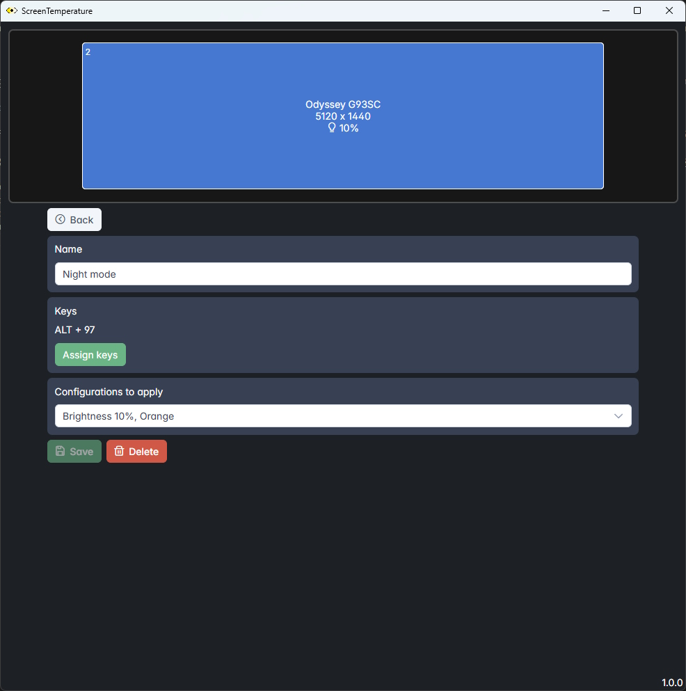

# ScreenTemperature
ScreenTemperature allows you to individually change the color temperature or the brightness of your screens (monitors).  


## Configuration


Right now there are two types of configuration types:

* **Temperature**
  Choose the color temperature that is right for you and keep your eyes comfortable by limiting blue light and using warmer colors.
  Using at night can make it easier to fall asleep.

* **Color**
  Choose whichever color that is right for you.

You can also change the brightness of your screen if it is **DDC/CI** compatible.

## Hot keys


Assign your configurations to hot keys.

## Requirements

* Windows 10 or newer
* A DDC/CI compatible monitor if you want to control brightness.
* Please make sure your video drivers are up to date.


## Download

* Github: 
  https://github.com/massaiTHEdog1/ScreenTemperature/releases/latest

## Build

### Requirements

For building the installer, you need these softwares and add them to PATH:

* [InnoSetup](https://jrsoftware.org/isdl.php) for building an installer.
* [Windows SDK](https://developer.microsoft.com/fr-fr/windows/downloads/windows-sdk/) for signing the installer.
* [Make (windows)](https://gnuwin32.sourceforge.net/packages/make.htm) for executing build pipeline.

### Command

In root folder run :

```
make
```

## Credits

Thanks to [Tanner Helland](https://github.com/tannerhelland) for his algorithm : https://tannerhelland.com/2012/09/18/convert-temperature-rgb-algorithm-code.html